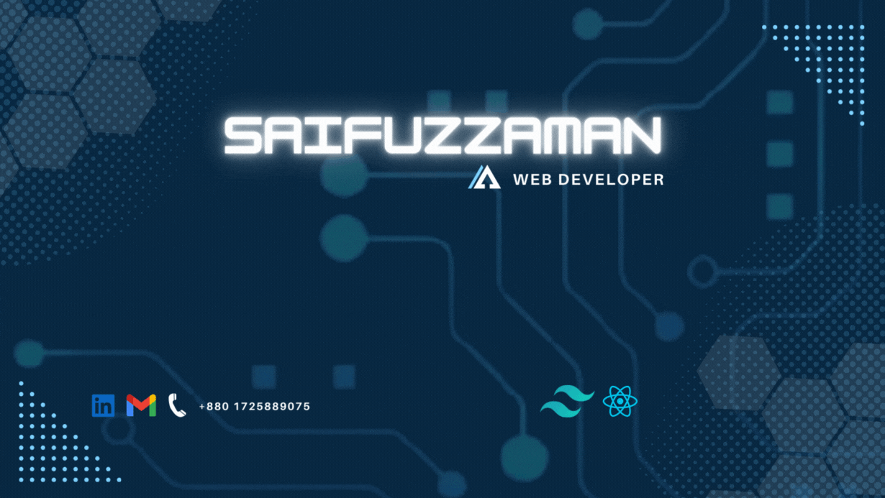

## 👨🏻‍💻 Technologies I am familiar with

  

## ⚡ I utilise tools

  

## 📧 Reach me out

  
  
  

## 📑 Present day synopsis

- 🔭 I’m currently working on : Full Stack Web Development.
- 🎯 I’m currently learning : Express js, Next js and MongoDB.
- 👯 I’m looking to collaborate on : Open source projects.
- 🤔 I’m looking for help : Who wants to learn coding.
- 💬 Ask me about : React and Tailwind.
- 🏍 Fun fact : Whenever I'm not coding, you can find me out on my bike.

## 📈 Current Stats

  

  
  

